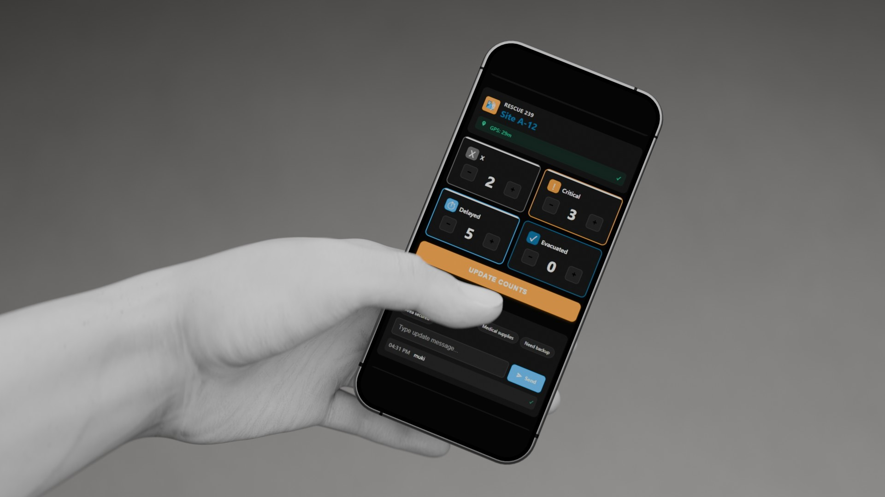
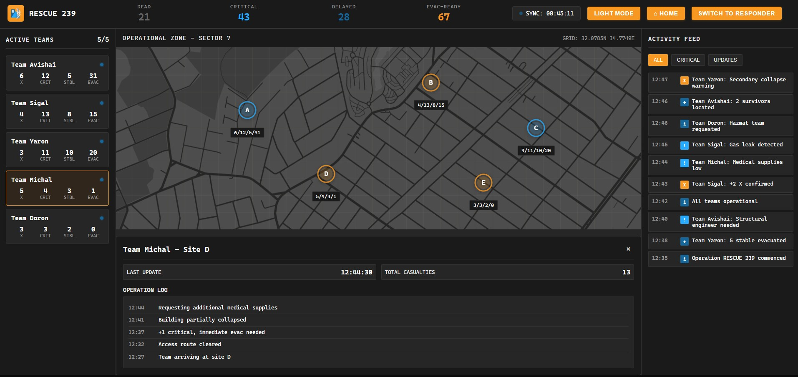

# Rescue 239 – Rapid Situation Reporting (Concept & Mock‑up)



> **Status:** Proof‑of‑concept · UI mock‑up · Looking for contributors  
> **Goal:** Provide IDF Reserve Unit 239 with a lightweight, offline‑capable casualty & asset reporting tool that runs on any soldier’s phone or laptop.

---

## 📜 Project Overview

This repo houses a **landing page prototype** (see `index.html`) and early UI screens for the planned Rescue 239 operational app.  
It is **not** production code—think of it as an invitation to experiment, fork, and iterate.

Key objectives:

* **Ultra‑rapid input** – single‑tap report sends in < 3 s  
* **Offline first** – works in underground shelters and remote rubble sites  
* **Command dashboard** – real‑time heat‑map and asset view  
* **Zero vendor lock‑in** – pure web tech (HTML + Tailwind + PWA APIs)

---

## 🚀 Quick Start

```bash
# clone & serve locally
git clone https://github.com/<your‑org>/rescue239.git
cd rescue239
# any static server works – here’s one‑liner with Python:
python -m http.server 3000
```

Open `http://localhost:3000` in your browser and explore the landing page/UX flow.

---

## 🗂 Folder Structure

```
.
├── assets/                  # UI screenshots, logos, mock‑ups
│   ├── homefront_logo.png
│   ├── mobile-mockup.jpg
│   └── screenshot_*.png
├── index.html               # responsive landing page
├── responder.html           # stub: field PWA shell
└── README.md
```

---

## 🛠 Tech Stack Targets (proposed)

| Layer | Proposed Choice       | Rationale                      |
|-------|-----------------------|--------------------------------|
| UI    | **Tailwind CSS**      | tiny bundle, utility‑first     |
| Logic | **TypeScript + Vite** | speedy DX, tree‑shaking        |
| Data  | **Supabase Edge** or **PocketBase** | JWT auth, instant REST & realtime |
| Hosting | **Vercel** (static) | free tier, fast edge           |
| CI    | GitHub Actions        | auto‑lint, deploy preview      |

Feel strongly about alternatives? Open a discussion!

---

## 🎯 Roadmap

| Milestone                        | Owner           | ETA    |
|---------------------------------|-----------------|--------|
| Hi‑fi Figma prototype           | @MuzaProductions| ✅ Week 1 |
| PWA responder shell             | _(help wanted)_ | Week 2 |
| API & WebSocket sync            | _(help wanted)_ | Week 3 |
| Commander dashboard MVP         | _(help wanted)_ | Week 4 |
| Offline field test (small squad)| Unit 239 pilots | Week 5 |
| Security hardening & docs       | _(help wanted)_ | Week 6 |

---

## 🤝 Contributing

1. Fork the repo & create a feature branch.  
2. Commit using conventional‑commit style (`feat:`, `fix:`…).  
3. Open a PR; small‑scope PRs preferred.  
4. Be ready for async code review—many of us are literally **in the field**.

If you’re new to open‑source, start with issues labeled **`good first issue`**.

---

## 📄 License

This prototype is released under the MIT License (see `LICENSE`).  
Logo & mock‑up imagery © 2025 Muza Productions — redistribute only within this project.

---

### Questions / Ideas?

Open an issue or ping **Gabriele · Muza Productions** at `info@muza‑prod.com`.

---

> *“Plan for the worst, code for the best – and test without network.”*
